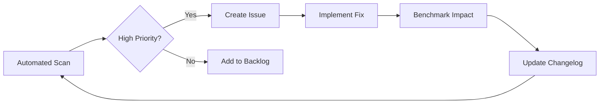

# ULTRON Agent - Evolution Framework Guide

## 🚀 Continuous Self-Improvement System

The Evolution Framework is a comprehensive system for automated performance monitoring, enhancement detection, and continuous improvement of the ULTRON Agent.

---

## Table of Contents

1. [Overview](#overview)
2. [Quick Start](#quick-start)
3. [Core Components](#core-components)
4. [Usage Guide](#usage-guide)
5. [API Endpoints](#api-endpoints)
6. [Automation](#automation)
7. [Metrics & Benchmarks](#metrics--benchmarks)
8. [Contributing](#contributing)

---

## Overview

### Key Features

- **📊 Performance Benchmarking**: Track CPU, memory, API latency, and service health
- **🔍 Code Analysis**: Automated scanning for optimization opportunities
- **💡 Smart Suggestions**: AI-powered improvement recommendations with priority rankings
- **📝 Automatic Changelog**: Version-tracked documentation of all enhancements
- **🔄 Scheduled Cycles**: Weekly automated improvement checks via GitHub Actions
- **📈 Historical Comparison**: Trend analysis and regression detection
- **👥 User Feedback**: Integrated feedback collection and analytics

### Architecture

```
┌─────────────────────────────────────────────────┐
│         ULTRON Evolution Framework              │
├─────────────────────────────────────────────────┤
│                                                 │
│  ┌──────────────┐      ┌──────────────┐       │
│  │  Benchmarking│◄────►│   Metrics    │       │
│  │    Engine    │      │   Storage    │       │
│  └──────────────┘      └──────────────┘       │
│         ▲                     │                 │
│         │                     ▼                 │
│  ┌──────────────┐      ┌──────────────┐       │
│  │ Enhancement  │◄────►│  Changelog   │       │
│  │   Scanner    │      │  Generator   │       │
│  └──────────────┘      └──────────────┘       │
│         ▲                     │                 │
│         │                     ▼                 │
│  ┌──────────────┐      ┌──────────────┐       │
│  │   Feedback   │◄────►│ Automation   │       │
│  │   System     │      │   Engine     │       │
│  └──────────────┘      └──────────────┘       │
│                                                 │
└─────────────────────────────────────────────────┘
```

---

## Quick Start

### Installation

No additional dependencies required beyond ULTRON Agent's standard requirements:

```bash
# Already included in requirements.txt
pip install psutil requests
```

### Basic Usage

```bash
# Run performance benchmark
python self_improvement.py --benchmark

# Scan for improvements
python self_improvement.py --scan

# View suggestions
python self_improvement.py --suggest

# Full automated cycle
python self_improvement.py --auto

# Generate report
python self_improvement.py --report
```

### First Run

```bash
# Initialize the evolution system
python self_improvement.py --auto

# Expected output:
# 🤖 Running Automated Improvement Cycle...
# ✅ Cycle Complete!
#    Version: dev-20251027
#    Total Suggestions: 15
#    High Priority: 3
```

---

## Core Components

### 1. Self-Improvement Engine (`self_improvement.py`)

**Purpose**: Main orchestration engine for continuous improvement

**Key Classes**:
- `PerformanceMetrics`: Data structure for system metrics
- `EnhancementSuggestion`: Structured improvement proposals
- `SelfImprovementEngine`: Core logic and workflows

**Methods**:
```python
engine = SelfImprovementEngine()

# Collect current metrics
metrics = engine.collect_metrics()

# Compare with history
comparison = engine.compare_metrics(metrics)

# Scan for improvements
suggestions = engine.scan_for_improvements()

# Generate changelog
engine.update_changelog(entry)
```

### 2. Performance Benchmarks (`metrics/benchmarks.json`)

**Tracked Metrics**:
- CPU usage percentage
- Memory usage percentage
- API response latency (ms)
- Ollama LLM latency (ms)
- GUI load time (ms)
- Active service count
- Tool ecosystem size

**Data Structure**:
```json
{
  "timestamp": "2025-10-27T10:30:00",
  "cpu_usage": 45.2,
  "memory_usage": 62.8,
  "response_time": 50.0,
  "api_latency": 12.5,
  "ollama_latency": 150.3,
  "gui_load_time": 250.7,
  "tool_count": 25,
  "active_services": 5,
  "version": "dev-20251027"
}
```

### 3. Enhancement Scanner

**Scans For**:
- Large files requiring modularization (>50KB)
- Missing documentation/docstrings
- TODO/FIXME comments
- Excessive imports (>20 per file)
- Missing error handling
- Low test coverage (<30%)
- Tool ecosystem gaps

**Output Example**:
```json
{
  "module": "brain.py",
  "category": "performance",
  "priority": "medium",
  "description": "Large file (85.2KB) may benefit from modularization",
  "estimated_impact": "Improved maintainability and load times",
  "suggested_action": "Split into smaller modules or refactor",
  "confidence": 0.7
}
```

### 4. Changelog Generator (`EVOLUTION_CHANGELOG.md`)

**Format**: Semantic versioning with categorized changes

**Sections**:
- Major Features
- Performance & Metrics
- UI/UX Improvements
- Technical Improvements
- Documentation
- Compatibility
- Impact Assessment

---

## Usage Guide

### Command-Line Interface

#### Run Benchmark

```bash
python self_improvement.py --benchmark

# Output:
# 🔬 Running Performance Benchmark...
# ✅ Benchmark Complete!
#    CPU Usage: 45.2%
#    Memory Usage: 62.8%
#    API Latency: 12.5ms
#    Active Services: 5
```

#### Scan for Improvements

```bash
python self_improvement.py --scan

# Output:
# 🔍 Scanning for Improvements...
# ✅ Scan Complete! Found 15 suggestions:
#    Critical: 0
#    High: 3
#    Medium: 8
#    Low: 4
```

#### View Suggestions

```bash
python self_improvement.py --suggest

# Output:
# 💡 Loading Improvement Suggestions...
# 📋 Top 3 High-Priority Suggestions:
#
# 1. [HIGH] tests/
#    Low test coverage: 5 tests for 20 modules (25.0%)
#    Action: Add unit tests for core modules
#    Impact: Improved code quality and regression prevention
```

#### Automated Cycle

```bash
python self_improvement.py --auto

# Runs complete cycle:
# 1. Performance benchmark
# 2. Improvement scan
# 3. Report generation
# 4. Metrics storage
```

#### Comprehensive Report

```bash
python self_improvement.py --report

# Generates full evolution report with:
# - Current performance metrics
# - Historical comparisons
# - Improvement opportunities
# - Priority breakdown
```

### Python API

```python
from self_improvement import SelfImprovementEngine

# Initialize engine
engine = SelfImprovementEngine()

# Collect metrics
metrics = engine.collect_metrics()
engine.save_metrics(metrics)

# Get comparison
comparison = engine.compare_metrics(metrics)
print(f"Status: {comparison['comparison']['status']}")

# Scan for improvements
suggestions = engine.scan_for_improvements()
high_priority = [s for s in suggestions if s.priority == 'high']

# Generate changelog entry
improvements = [
    "Added new tool for database management",
    "Optimized memory usage in brain.py"
]
entry = engine.generate_changelog_entry(improvements)
engine.update_changelog(entry)
```

---

## API Endpoints

### Feedback Submission

**POST** `/api/feedback`

Submit user feedback for system improvement.

**Request Body**:
```json
{
  "type": "performance",
  "message": "GUI loads slowly on startup",
  "rating": 4,
  "context": {
    "browser": "Chrome",
    "os": "Windows 11"
  }
}
```

**Response**:
```json
{
  "success": true,
  "message": "Feedback received successfully",
  "feedback_id": 42
}
```

**Feedback Types**:
- `bug`: Bug reports
- `feature`: Feature requests
- `performance`: Performance issues
- `usability`: UX/UI feedback

### Feedback Statistics

**GET** `/api/feedback/stats`

Get aggregated feedback statistics.

**Response**:
```json
{
  "total": 42,
  "by_type": {
    "performance": 15,
    "feature": 20,
    "bug": 5,
    "usability": 2
  },
  "avg_rating": 4.2,
  "recent": [...]
}
```

### Evolution Metrics

**GET** `/api/evolution/metrics`

Get performance metrics history.

**Response**:
```json
{
  "total_snapshots": 50,
  "latest": {
    "timestamp": "2025-10-27T10:30:00",
    "cpu_usage": 45.2,
    "memory_usage": 62.8,
    ...
  },
  "history": [...]
}
```

### Enhancement Suggestions

**GET** `/api/evolution/suggestions?priority=high`

Get improvement suggestions.

**Query Parameters**:
- `priority`: Filter by priority (critical, high, medium, low)

**Response**:
```json
{
  "total": 3,
  "suggestions": [
    {
      "module": "tests/",
      "category": "reliability",
      "priority": "high",
      "description": "Low test coverage...",
      ...
    }
  ]
}
```

---

## Automation

### GitHub Actions Workflow

**File**: `.github/workflows/self_improvement.yml`

**Triggers**:
- **Weekly**: Every Monday at 00:00 UTC
- **On Push**: When Python files or tools change
- **Manual**: Via workflow_dispatch

**Jobs**:

#### 1. Self-Improvement Cycle
- Runs benchmark
- Scans for improvements
- Generates report
- Creates GitHub issues for high-priority suggestions
- Uploads artifacts
- Commits metrics

#### 2. Performance Regression Check
- Runs on every push
- Compares with previous benchmark
- Warns on regressions >20%
- Comments on pull requests

### Setup GitHub Actions

1. **Enable Workflow**:
   ```bash
   # Already configured in .github/workflows/self_improvement.yml
   git add .github/workflows/self_improvement.yml
   git commit -m "Add self-improvement workflow"
   git push
   ```

2. **Configure Secrets** (if needed):
   - No secrets required for basic functionality
   - Optional: Add `GITHUB_TOKEN` for PR comments (auto-provided)

3. **Manual Trigger**:
   - Go to Actions tab in GitHub
   - Select "ULTRON Self-Improvement Cycle"
   - Click "Run workflow"

### Local Automation

**Cron Job** (Linux/Mac):
```bash
# Edit crontab
crontab -e

# Add weekly run (Monday 00:00)
0 0 * * 1 cd /path/to/ultron_agent && python self_improvement.py --auto

# Add daily benchmark
0 9 * * * cd /path/to/ultron_agent && python self_improvement.py --benchmark
```

**Task Scheduler** (Windows):
```powershell
# Create scheduled task for weekly improvement cycle
$action = New-ScheduledTaskAction -Execute "python" -Argument "self_improvement.py --auto" -WorkingDirectory "C:\Projects\ultron_agent"
$trigger = New-ScheduledTaskTrigger -Weekly -DaysOfWeek Monday -At 00:00
Register-ScheduledTask -Action $action -Trigger $trigger -TaskName "ULTRON-Evolution" -Description "Weekly self-improvement cycle"
```

---

## Metrics & Benchmarks

### Viewing Metrics

**Raw JSON**:
```bash
# View all benchmarks
cat metrics/benchmarks.json | jq '.'

# View latest benchmark
cat metrics/benchmarks.json | jq '.[-1]'

# Compare last two
cat metrics/benchmarks.json | jq '.[- 2:]'
```

**Python Analysis**:
```python
import json
from pathlib import Path

# Load metrics
with open('metrics/benchmarks.json') as f:
    history = json.load(f)

# Calculate averages
avg_cpu = sum(m['cpu_usage'] for m in history) / len(history)
avg_memory = sum(m['memory_usage'] for m in history) / len(history)

print(f"Average CPU: {avg_cpu:.1f}%")
print(f"Average Memory: {avg_memory:.1f}%")

# Detect trends
recent = history[-10:]
trend_cpu = recent[-1]['cpu_usage'] - recent[0]['cpu_usage']
print(f"CPU Trend (last 10): {trend_cpu:+.1f}%")
```

### Performance Targets

| Metric | Target | Warning | Critical |
|--------|--------|---------|----------|
| CPU Usage | <50% | 50-80% | >80% |
| Memory Usage | <70% | 70-85% | >85% |
| API Latency | <20ms | 20-50ms | >50ms |
| GUI Load | <500ms | 500-1000ms | >1000ms |
| Active Services | 5+ | 3-4 | <3 |

---

## Contributing

### Adding New Checks

**Location**: `self_improvement.py` → `scan_for_improvements()`

**Example**:
```python
# Check for security vulnerabilities
for py_file in PROJECT_ROOT.glob("**/*.py"):
    with open(py_file, 'r') as f:
        content = f.read()
        if 'eval(' in content or 'exec(' in content:
            suggestions.append(EnhancementSuggestion(
                module=str(py_file.relative_to(PROJECT_ROOT)),
                category="security",
                priority="critical",
                description="Unsafe eval/exec usage detected",
                estimated_impact="Prevent code injection vulnerabilities",
                suggested_action="Replace with safe alternatives",
                confidence=0.95
            ))
```

### Adding New Metrics

**Location**: `self_improvement.py` → `PerformanceMetrics` dataclass

**Example**:
```python
@dataclass
class PerformanceMetrics:
    # Existing fields...

    # New field
    cache_hit_rate: float  # Add new metric

# Update collect_metrics()
def collect_metrics(self) -> PerformanceMetrics:
    # Existing collection...

    # Collect new metric
    cache_hits = get_cache_stats()['hits']
    cache_total = get_cache_stats()['total']
    cache_hit_rate = cache_hits / cache_total if cache_total > 0 else 0

    metrics = PerformanceMetrics(
        # Existing metrics...
        cache_hit_rate=cache_hit_rate
    )
```

### Extending Automation

**Add New Workflow Job**:
```yaml
# .github/workflows/self_improvement.yml

  security-scan:
    runs-on: ubuntu-latest
    steps:
      - name: Run Security Audit
        run: |
          python self_improvement.py --scan-security

      - name: Create Security Issue
        if: findings detected
        uses: actions/github-script@v6
        # ...
```

---

## Best Practices

### Regular Maintenance

1. **Weekly**: Review high-priority suggestions
2. **Monthly**: Analyze performance trends
3. **Quarterly**: Comprehensive system audit
4. **Per Release**: Benchmark comparison

### Interpreting Results

**Performance Regression**:
- CPU increase >20%: Investigate recent changes
- Memory leak: Check for resource cleanup
- Latency spike: Review network/database calls

**Suggestion Prioritization**:
1. **Critical**: Security, breaking bugs (immediate)
2. **High**: Performance, reliability (this sprint)
3. **Medium**: Features, optimization (next sprint)
4. **Low**: Nice-to-have, tech debt (backlog)

### Continuous Improvement Workflow



---

## Troubleshooting

### Common Issues

**"No metrics available"**:
```bash
# Run initial benchmark
python self_improvement.py --benchmark
```

**"Services not responding"**:
```bash
# Start ULTRON services first
.\run.bat

# Then run benchmark
python self_improvement.py --benchmark
```

**"Permission denied" (Windows)**:
```powershell
# Run as administrator or adjust task scheduler permissions
```

### Debug Mode

```bash
# Enable verbose logging
export ULTRON_DEBUG=1
python self_improvement.py --auto
```

---

## Roadmap

### Upcoming Features

- [ ] Machine learning-based suggestion prioritization
- [ ] Automated refactoring for common patterns
- [ ] Visual dashboard for metrics
- [ ] A/B testing framework
- [ ] Integration with CI/CD pipelines
- [ ] Real-time alerting system
- [ ] Community suggestion voting

---

## Support

For issues, questions, or contributions:

- **GitHub Issues**: [Create an issue](https://github.com/your-repo/ultron_agent/issues)
- **Discussions**: [Join the conversation](https://github.com/your-repo/ultron_agent/discussions)
- **Feedback API**: Submit via `/api/feedback` endpoint

---

*Last Updated: 2025-10-27*
*Evolution Framework Version: 1.0.0*
